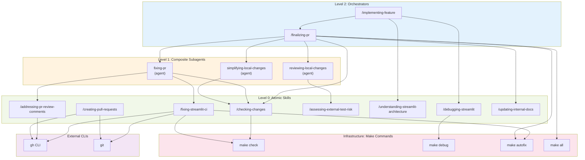

import swissCheeseModel from './swiss-cheese-model-codebase.svg';
import agentDocsExample from './agent-docs-example.png';
import aiIssueTriage from './ai-issue-triage.png';
import aiPrReview from './ai-pr-review.png';

Features that used to take a sprint now ship in hours. Newly reported bugs are at a three-year low. The codebase is fixing its own flaky tests, updating docs, and closing coverage gaps — without anyone asking.

None of that happened because of clever prompts or waiting for the right model. It happened because we redesigned the codebase itself to work well for agents.

[Streamlit](https://github.com/streamlit/streamlit) is an open-source Python library used by over a million developers. Over the past year, we turned it into an environment where coding agents own the majority of feature work and maintenance — while humans focus on product, design, and architecture decisions. The single biggest lesson: when an agent produces bad output, the problem is almost always the repo, not the AI.

This post is the playbook. We'll walk through the layered system — rules, skills, subagents, hooks, and automation — that made it work, tuned for the tools our team actually uses: Claude Code and Cursor.

The foundation underneath all of it: the GitHub repo is the single source of truth — code, docs, specs, rules, and automation all live together in one place. An agent with access to the repo should be able to help with almost any project-related task.

## Swiss cheese, not silver bullets

There is no single trick that makes agents reliable in a mature codebase. The mental model that has worked best for us is the Swiss-cheese model: many imperfect layers, stacked together.


Some layers prevent bad output: linting, type checking, tests, hooks. Some layers help agents produce good output in the first place: clear code, well-placed rules, architecture docs, specs. And some layers catch what slips through anyway: AI review, human review. No single slice is enough. The stack is what makes agents produce high-quality code.

These are the layers we focused on:

## 1. Simplify until agents stop tripping

Humans can adapt to friction over time. We learn the weird build step, the inconsistent naming, and the undocumented workflow. Agents have a much lower tolerance for ambiguity, inconsistency, and unnecessary complexity.

So we started treating agent confusion as signal. If agents repeatedly got lost in one area of the codebase, produced bad code, or slowed down on a recurring workflow, that was usually a sign that the system itself needed work.

We refactored, modernized, and simplified parts of the codebase and the development setup to remove tech debt and ambiguity. We also sped up key workflows, because fast feedback loops matter a lot when an agent is doing the work.

This turned out to be one of the most useful mindset shifts for us: where agents struggle is often where the codebase wants simplification anyway.

## 2. Install hard guardrails and make them fast

If you want more feature velocity in a widely used library, you need stronger guardrails, not weaker ones. Otherwise you just move the bottleneck from implementation to review and cleanup.

So we tightened linting, formatting, type checking, and pre-commit enforcement across Python, TypeScript, and Protobuf - the stack we use in Streamlit - with automated fixes wherever possible.

On the Python side, that meant roughly 800 `ruff` rules (`ALL` + preview), `ty` as an ultra-fast type checker to keep the feedback loop fast, and `mypy` strict mode across all Python files. On the TypeScript side, that meant stricter `eslint` and type-checking rules, custom rules for project-specific constraints, `oxlint` for fast agent feedback, and `knip` to keep the project clean. For Protobuf, we added `buf` for linting and formatting.

Beyond individual tools, we added a fast [`make check`](https://github.com/streamlit/streamlit/blob/develop/Makefile) path that runs the relevant checks and tests for the files changed in a branch. On top of that, we added CI checks and dashboards around [size](https://issues.streamlit.app/wheel_size), [performance](https://issues.streamlit.app/playwright), [coverage](https://issues.streamlit.app/Test_Coverage_(Python)), [flaky tests](https://issues.streamlit.app/flaky_tests), [load tests](https://issues.streamlit.app/load_testing), and [e2e health](https://issues.streamlit.app/playwright_stats).

We encoded policy into hooks so agents do not need to remember everything perfectly, e.g.:

```text
.claude/hooks/
├── pre_bash_redirect.py   # block non-compliant commands, suggest the right ones
├── post_edit_autofix.sh   # auto-fix files after edits
└── stop_check.sh          # run make check before completion
```

The point was not process for the sake of process. The point was to make the correct path cheap, fast, visible, and enforceable.

## 3. Move context into the repo

Agents can only reliably use what they can actually discover. So we kept pushing project knowledge into version control.

We added [`AGENTS.md` files throughout the codebase](https://github.com/search?q=path%3A**%2FAGENTS.md+repo%3Astreamlit%2Fstreamlit+&type=code&ref=advsearch) and kept refining them whenever agents ran into friction or repeated mistakes. Those files live close to the code they describe, so the guidance is local instead of buried in some global prompt.

We cleaned up noisy logs across development commands and added more useful error output. Agents read logs. Bad logs mean bad context.

We also moved more durable knowledge into the repo: [architecture docs](https://github.com/streamlit/streamlit/blob/develop/.claude/skills/understanding-streamlit-architecture/SKILL.md), [API design principles](https://github.com/streamlit/streamlit/blob/develop/specs/AGENTS.md#principles-of-streamlit-api-design), the [development wiki](https://github.com/streamlit/streamlit/tree/develop/wiki), and our speccing process in [`specs/`](https://github.com/streamlit/streamlit/tree/develop/specs). Specs are our primary artifact for new features — a practice known as spec-driven development. A well-written spec gives an agent enough context to produce a working implementation, and gives reviewers a clear reference point.

We keep coming back to the same rule: if knowledge matters repeatedly, it should not stay trapped in a review comment, a Notion page, a Jira ticket, or somebody's head. It belongs in the repo.

Every PR review is a context audit. Repeated feedback is often just missing repository knowledge in disguise. The exact way different tools consume that context will keep changing, and that is fine. What matters is that the rules, docs, specs, and workflow definitions live in version control instead of in some isolated space.

Not all agent-generated content belongs in the main repo, though. Implementation plans, codebase explorations, and design notes are valuable during review but are not long-lived documentation. We needed a scratch space for agents — somewhere to put working material that reviewers can find but that does not pollute the main repo.

We ended up repurposing the [GitHub wiki git repo](https://docs.github.com/en/communities/documenting-your-project-with-wikis/about-wikis) for this. Every GitHub repository comes with a wiki repo attached to it. We disabled the wiki UI and use the bare git repo purely as a shared artifact store. Agents push documents there organized by PR number and link them automatically so reviewers can see the full context. Since the wiki repo is checked out locally, agents working on new changes also have access to prior implementation plans and explorations, which helps them build on existing work.


It is a hack, honestly. But it works surprisingly well as a lightweight, version-controlled scratch space that lives right next to the main repo.

## 4. Turn recurring work into reusable skills

Once the basics were in place, we started packaging recurring engineering work into reusable skills and subagents. A lot of "agent productivity" is just taking messy recurring work and turning it into explicit well-defined workflows.



At the bottom are atomic skills: small, focused capabilities that do one thing well. Examples include [`checking-changes`](https://github.com/streamlit/streamlit/blob/develop/.claude/skills/checking-changes/SKILL.md), [`debugging-streamlit`](https://github.com/streamlit/streamlit/blob/develop/.claude/skills/debugging-streamlit/SKILL.md), [`addressing-pr-review-comments`](https://github.com/streamlit/streamlit/blob/develop/.claude/skills/addressing-pr-review-comments/SKILL.md), and [`updating-internal-docs`](https://github.com/streamlit/streamlit/tree/develop/.claude/skills/updating-internal-docs).

Above that are composite subagents like [`simplifying-local-changes`](https://github.com/streamlit/streamlit/blob/develop/.claude/agents/simplifying-local-changes.md), [`reviewing-local-changes`](https://github.com/streamlit/streamlit/blob/develop/.claude/agents/reviewing-local-changes.md), and [`fixing-pr`](https://github.com/streamlit/streamlit/blob/develop/.claude/agents/fixing-pr.md). We use subagents when a workflow benefits from an isolated context, so higher-level tasks can run end to end without dragging around a giant context window.

At the top are orchestrator skills like [`finalizing-pr`](https://github.com/streamlit/streamlit/blob/develop/.claude/skills/finalizing-pr/SKILL.md) and [`implementing-feature`](https://github.com/streamlit/streamlit/blob/develop/.claude/skills/implementing-feature/SKILL.md), which take a broader goal and coordinate the lower-level pieces into a full workflow.

A skill is more than a prompt: it is an engineered, reusable unit of process that can be composed into higher-level workflows.

One thing we still lack is good visibility into how well this system works — which skills get invoked, what documentation gets read, where agents slow down. We added basic invocation metrics to PRs, but there is room to improve.

## 5. Let AI review AI

As output goes up, review becomes the next bottleneck. So we invested in multiple layers of AI review instead of expecting human reviewers to absorb all of the extra volume.

On the issue side, we added a [custom AI issue triage workflow](https://github.com/streamlit/streamlit/blob/develop/.github/workflows/ai-issue-triage.yml) that provides an initial analysis, finds related issues, and applies labels. On the PR side, we use GitHub Copilot, Cursor BugBot, and Graphite as a first layer of fast automated review.


We also built a [custom multi-model PR review workflow](https://github.com/streamlit/streamlit/blob/develop/.github/workflows/ai-pr-review.yml). It lets us review a PR with an arbitrary combination of models. Right now that includes `gpt-5.3-codex-high`, `gemini-3.1-pro`, and `opus-4.6-thinking`, with one acting as the judge.


That review layer has been one of the highest-leverage pieces of the whole setup. It catches non-obvious issues, and by the time a human reviewer opens the PR, most of the boring stuff is already handled.

## 6. Automate everything

Once a workflow is stable, manual repetition becomes hard to justify. So we automated the recurring work: dependency updates, parts of the release process, asset updates, cleanups, and a growing set of AI-powered GitHub Actions workflows. A few examples:

- [`ai-update-docs`](https://github.com/streamlit/streamlit/blob/develop/.github/workflows/ai-update-docs.yml) runs every week to keep internal docs aligned with the current codebase [[example](https://github.com/streamlit/streamlit/pull/14493)].
- [`ai-fix-flaky-e2e-tests`](https://github.com/streamlit/streamlit/blob/develop/.github/workflows/ai-fix-flaky-e2e-tests.yml) runs every week to detect and fix e2e flakiness [[example](https://github.com/streamlit/streamlit/pull/14624)].
- [`ai-test-coverage`](https://github.com/streamlit/streamlit/blob/develop/.github/workflows/ai-test-coverage.yml) automatically improves unit test coverage.

As our confidence in the harness increases, we are gradually moving more tasks into automated workflows: implement a feature PR when a spec is merged, implement bug-fix PRs when issues arrive, autofix PRs when CI fails or review comments come in, and automate more of the maintenance layer.

## How our work changed

When we started, most of the team's time went into feature implementation, issue triage, bug fixes, and maintenance. Now agents handle the majority of that work. The team spends more time on product decisions, architecture, design, and review — the work that benefits most from human judgment.

That shift did not come from better prompts or models. It came from optimizing the repo itself to work well for agents — layer by layer. Once code, docs, specs, rules, workflows, and automation all live together, the agent starts to behave like a productive contributor operating inside a well-designed system.

We are not done. There is always more context to move into the repo, more workflows to automate, more layers to stack. Every improvement to the harness compounds into higher velocity.
